I understand you want individual Mermaid diagrams for each Kubernetes resource (Deployment, Service, CronJob, DaemonSet, etc.) in addition to the existing diagrams for StatefulSet and RBAC, and the comprehensive resource relationships diagram. I'll update the Markdown file to include a Mermaid diagram for each resource under its respective section, ensuring each diagram illustrates the resource's structure and interactions (e.g., how it manages or connects to other resources like Pods, Services, or PVCs). The comprehensive resource relationships diagram will remain in the "Resource Relationships" section to provide an overview, and the existing StatefulSet and RBAC diagrams will be retained.

### Approach
- **New Mermaid Diagrams**: Add individual Mermaid diagrams for the following resources under their respective sections:
  - Namespace
  - Pod
  - Deployment
  - Service
  - ConfigMap
  - Secret
  - PersistentVolume (PV) and PersistentVolumeClaim (PVC)
  - Ingress
  - Job
  - CronJob
  - DaemonSet
- **Existing Diagrams**: Retain the StatefulSet diagram, RBAC diagram, and the comprehensive resource relationships diagram.
- **Diagram Design**:
  - Each diagram will focus on the resource's role and its immediate interactions (e.g., Deployment managing Pods via ReplicaSets, Service routing to Pods, etc.).
  - Use simple, clear graphs to avoid clutter, tailored to each resource's purpose.
  - Ensure consistency in style (e.g., using `graph TD` for top-down flow).
- **Confluence Compatibility**: Use Mermaid syntax compatible with Confluence's Mermaid plugin. Include a placeholder for attaching PNGs if the plugin is unavailable.
- **Artifact Update**: Reuse the same artifact ID (`9fa66cce-2412-4de2-a944-2b79736e3b05`) since this is an update to the previous artifact, with a new version ID.

Below is the updated Markdown file with individual Mermaid diagrams for each resource.


# Introduction to Kubernetes Resources

This page provides a comprehensive overview of Kubernetes (K8s) resources, the core components for deploying and managing containerized applications in a Kubernetes cluster. Understanding these resources is essential for leveraging Kubernetes to orchestrate workloads effectively. This guide includes detailed explanations, examples, best practices, and diagrams to illustrate each resource's role and interactions.

## What are Kubernetes Resources?

Kubernetes resources are objects defined in YAML or JSON manifests that represent the desired state of components in a Kubernetes cluster. The Kubernetes control plane manages these objects to ensure the cluster's actual state matches the desired state. Each resource serves a specific purpose, such as managing containers, networking, storage, or access control.

## Key Kubernetes Resources

Below is a detailed explanation of essential Kubernetes resources, including their purpose, structure, examples, best practices, and Mermaid diagrams to visualize their interactions.

### 1. Namespace

**Purpose**: Provides logical isolation for resources within a cluster, enabling multi-tenancy and organization.

**Key Characteristics**:
- Scopes resources like Pods, Services, and ConfigMaps to avoid naming conflicts.
- Default namespaces include `default`, `kube-system`, and `kube-public`.
- Supports RBAC for access control within a namespace.

**Example**:
```yaml
apiVersion: v1
kind: Namespace
metadata:
  name: dev
```

**Diagram**: Namespace Scope
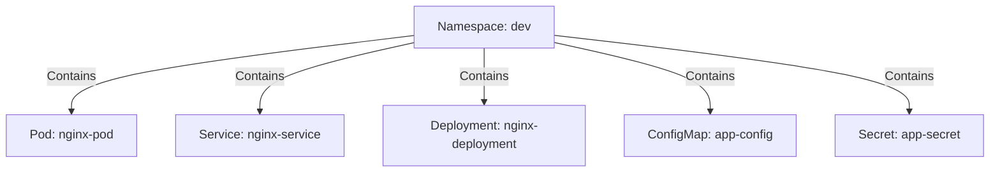

**Best Practices**:
- Use namespaces to separate environments (e.g., `dev`, `prod`) or teams.
- Apply resource quotas to limit CPU/memory usage per namespace.
- Avoid using the `default` namespace for production workloads.

### 2. Pod

**Purpose**: The smallest deployable unit, representing one or more containers that share storage and network.

**Key Characteristics**:
- Ephemeral and typically managed by controllers like Deployments.
- Containers in a Pod share the same network namespace (localhost communication) and storage volumes.

**Example**:
```yaml
apiVersion: v1
kind: Pod
metadata:
  name: nginx-pod
  namespace: dev
  labels:
    app: nginx
spec:
  containers:
  - name: nginx
    image: nginx:1.14.2
    ports:
    - containerPort: 80
```

**Diagram**: Pod Structure
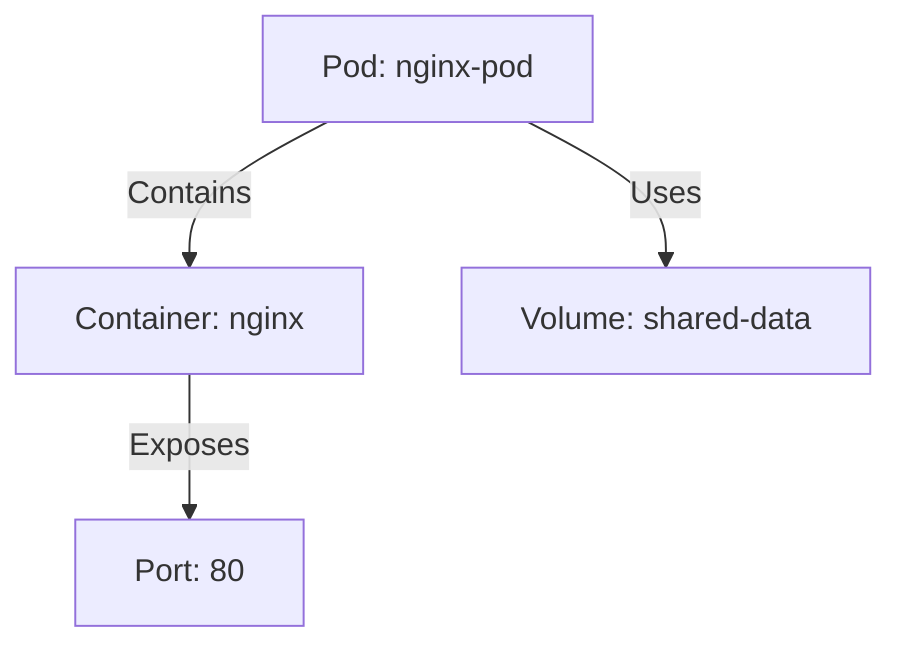

**Best Practices**:
- Use Pods directly for debugging or one-off tasks, not production.
- Group related containers (e.g., app and logging sidecar) in a single Pod.

### 3. Deployment

**Purpose**: Manages a set of identical Pods, ensuring they are running, updated, and scaled.

**Key Characteristics**:
- Uses ReplicaSets for declarative updates.
- Supports rolling updates and rollbacks.
- Ideal for stateless applications.

**Example**:
```yaml
apiVersion: apps/v1
kind: Deployment
metadata:
  name: nginx-deployment
  namespace: dev
spec:
  replicas: 3
  selector:
    matchLabels:
      app: nginx
  template:
    metadata:
      labels:
        app: nginx
    spec:
      containers:
      - name: nginx
        image: nginx:1.14.2
        ports:
        - containerPort: 80
```

**Diagram**: Deployment Workflow
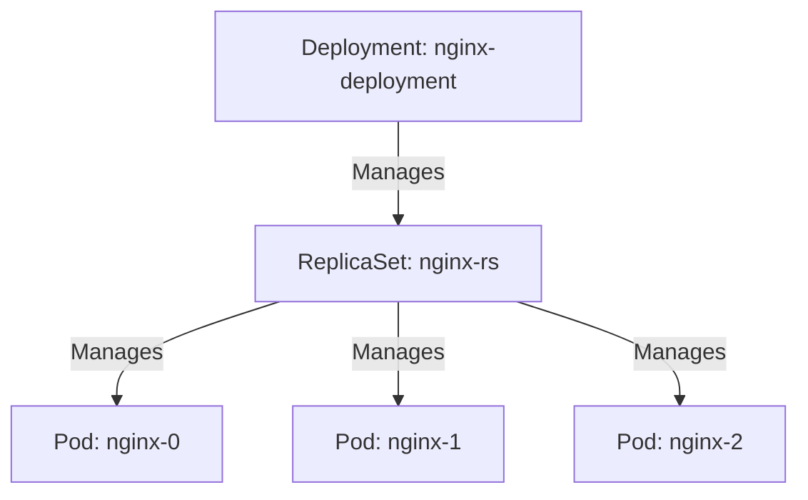

**Best Practices**:
- Define resource limits and requests for CPU/memory.
- Use readiness and liveness probes for Pod health checks.

### 4. Service

**Purpose**: Provides a stable network endpoint to access a set of Pods, typically via label selectors.

**Key Characteristics**:
- Abstracts Pod IP changes with load balancing.
- Types: ClusterIP (default), NodePort, LoadBalancer, ExternalName.
- Integrates with Kubernetes DNS.

**Example**:
```yaml
apiVersion: v1
kind: Service
metadata:
  name: nginx-service
  namespace: dev
spec:
  selector:
    app: nginx
  ports:
  - protocol: TCP
    port: 80
    targetPort: 80
  type: ClusterIP
```

**Diagram**: Service Routing
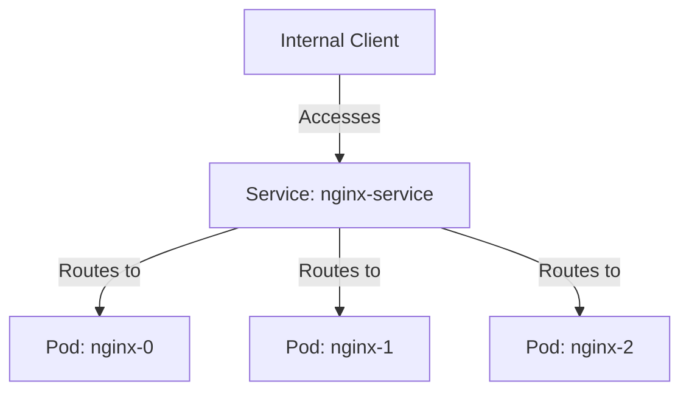

**Best Practices**:
- Use ClusterIP for internal services, LoadBalancer for external access.
- Ensure selector labels match Pod labels.

### 5. ConfigMap

**Purpose**: Stores non-sensitive configuration data as key-value pairs.

**Key Characteristics**:
- Mounted as environment variables, arguments, or volumes.
- Supports dynamic updates in some cases.

**Example**:
```yaml
apiVersion: v1
kind: ConfigMap
metadata:
  name: app-config
  namespace: dev
data:
  db_host: "mysql-service"
  log_level: "debug"
```

**Diagram**: ConfigMap Usage
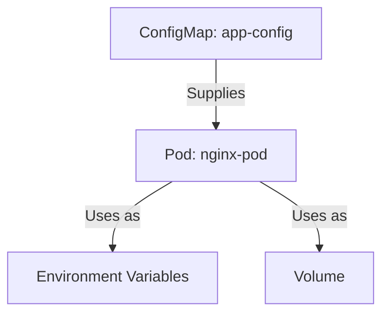

**Best Practices**:
- Use ConfigMaps for configuration; use Secrets for sensitive data.
- Keep ConfigMaps small to avoid performance issues.

### 6. Secret

**Purpose**: Stores sensitive data, such as passwords or tokens, in Base64-encoded format.

**Key Characteristics**:
- Mounted as environment variables or volumes.
- Access controlled via RBAC.

**Example**:
```yaml
apiVersion: v1
kind: Secret
metadata:
  name: app-secret
  namespace: dev
type: Opaque
data:
  db_password: bXlwYXNzd29yZA==  # Base64-encoded "mypassword"
```

**Diagram**: Secret Usage
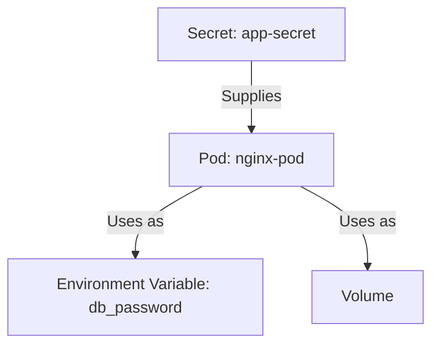

**Best Practices**:
- Enable encryption at rest for Secrets.
- Restrict access using RBAC.

### 7. PersistentVolume (PV) and PersistentVolumeClaim (PVC)

**Purpose**: Manages storage for stateful applications.

**Key Characteristics**:
- **PV**: Represents cluster storage (static or dynamic).
- **PVC**: Requests storage, binding to a PV.
- Supports various backends (e.g., NFS, cloud storage).

**Example**:
```yaml
# PersistentVolume
apiVersion: v1
kind: PersistentVolume
metadata:
  name: mysql-pv
spec:
  capacity:
    storage: 10Gi
  accessModes:
    - ReadWriteOnce
  hostPath:
    path: "/mnt/data"

# PersistentVolumeClaim
apiVersion: v1
kind: PersistentVolumeClaim
metadata:
  name: mysql-pvc
  namespace: dev
spec:
  accessModes:
    - ReadWriteOnce
  resources:
    requests:
      storage: 10Gi
```

**Diagram**: PV and PVC Interaction
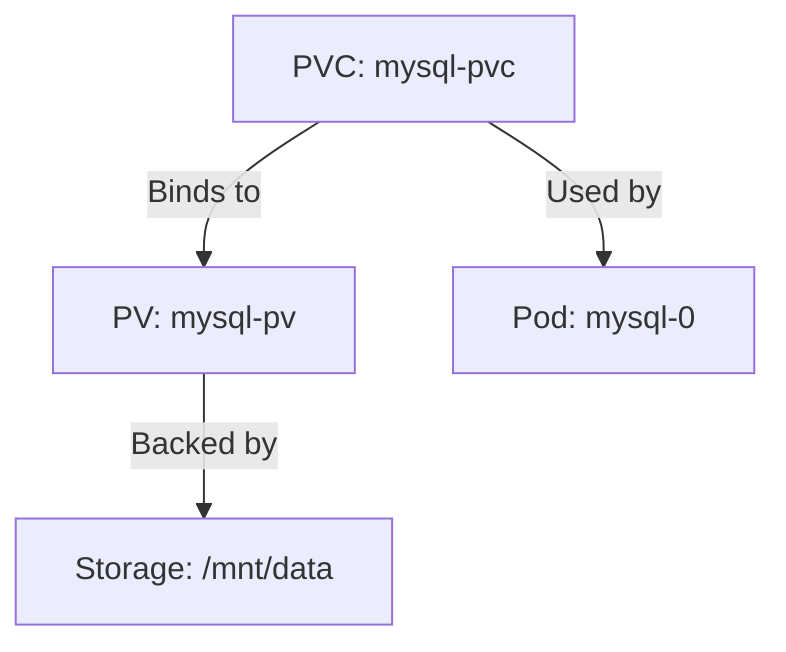

**Best Practices**:
- Use dynamic provisioning with StorageClasses.
- Backup critical data in PVs.

### 8. StatefulSet

**Purpose**: Manages stateful applications with stable identities and persistent storage.

**Key Characteristics**:
- Provides unique Pod names (e.g., `mysql-0`, `mysql-1`).
- Ensures ordered deployment/scaling.
- Pairs with PVCs and headless Services.

**Example**:
```yaml
apiVersion: apps/v1
kind: StatefulSet
metadata:
  name: mysql
  namespace: dev
spec:
  serviceName: "mysql"
  replicas: 3
  selector:
    matchLabels:
      app: mysql
  template:
    metadata:
      labels:
        app: mysql
    spec:
      containers:
      - name: mysql
        image: mysql:5.7
        env:
        - name: MYSQL_ROOT_PASSWORD
          valueFrom:
            secretKeyRef:
              name: app-secret
              key: db_password
        volumeMounts:
        - name: mysql-persistent-storage
          mountPath: "/var/lib/mysql"
  volumeClaimTemplates:
  - metadata:
      name: mysql-persistent-storage
    spec:
      accessModes: ["ReadWriteOnce"]
      resources:
        requests:
          storage: 10Gi
```

**Diagram**: StatefulSet Architecture
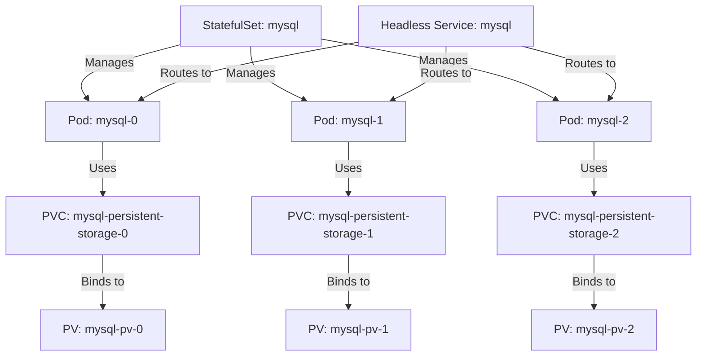

**Best Practices**:
- Use for databases or stateful apps.
- Pair with headless Services for stable DNS.

### 9. Ingress

**Purpose**: Manages external HTTP/HTTPS access to Services with URL-based routing.

**Key Characteristics**:
- Requires an Ingress Controller (e.g., NGINX).
- Supports path-based routing and SSL.

**Example**:
```yaml
apiVersion: networking.k8s.io/v1
kind: Ingress
metadata:
  name: app-ingress
  namespace: dev
  annotations:
    nginx.ingress.kubernetes.io/rewrite-target: /
spec:
  rules:
  - host: example.com
    http:
      paths:
      - path: /app
        pathType: Prefix
        backend:
          service:
            name: nginx-service
            port:
              number: 80
```

**Diagram**: Ingress Routing
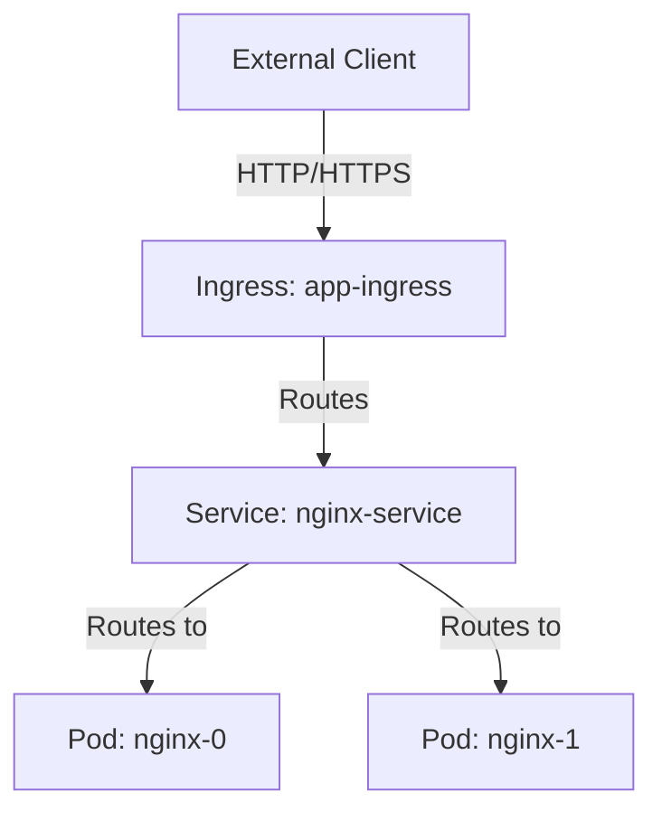

**Best Practices**:
- Secure with TLS certificates.
- Monitor Ingress Controller performance.

### 10. Job

**Purpose**: Manages one-off tasks that run to completion.

**Key Characteristics**:
- Ensures Pods complete their task successfully.
- Supports parallelism for batch processing.

**Example**:
```yaml
apiVersion: batch/v1
kind: Job
metadata:
  name: data-process
  namespace: dev
spec:
  template:
    spec:
      containers:
      - name: processor
        image: data-processor:1.0
      restartPolicy: Never
  backoffLimit: 4
```

**Diagram**: Job Execution
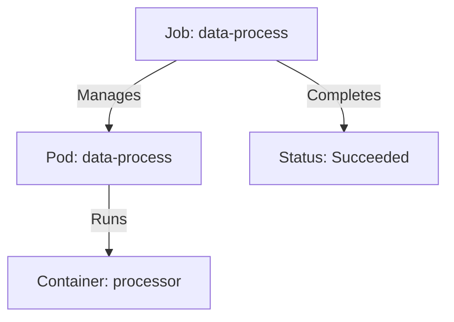

**Best Practices**:
- Use Jobs for tasks like database migrations or batch jobs.
- Set `backoffLimit` and `restartPolicy` appropriately.

### 11. CronJob

**Purpose**: Schedules recurring tasks using a cron-like schedule.

**Key Characteristics**:
- Creates Jobs at specified intervals.
- Supports concurrency policies (e.g., `Forbid`, `Allow`).

**Example**:
```yaml
apiVersion: batch/v1
kind: CronJob
metadata:
  name: nightly-report
  namespace: dev
spec:
  schedule: "0 1 * * *"
  jobTemplate:
    spec:
      template:
        spec:
          containers:
          - name: report-gen
            image: report-generator:1.0
          restartPolicy: OnFailure
```

**Diagram**: CronJob Scheduling
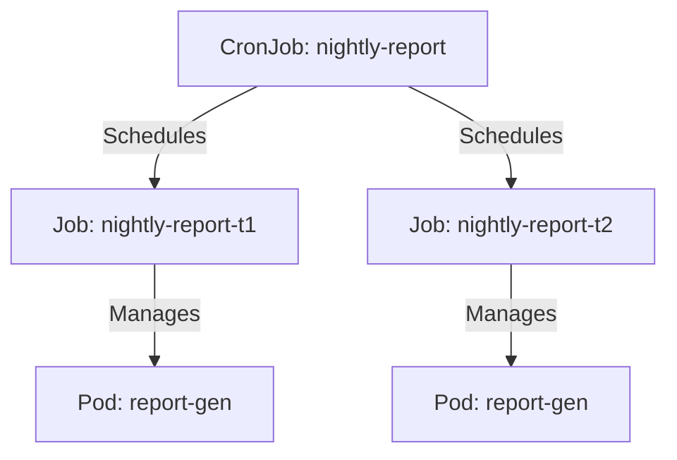

**Best Practices**:
- Use for scheduled tasks like backups or reports.
- Monitor job history to avoid resource accumulation.

### 12. DaemonSet

**Purpose**: Ensures a Pod runs on every node in the cluster (or a subset).

**Key Characteristics**:
- Ideal for node-level tasks like logging or monitoring agents.
- Automatically scales with cluster nodes.

**Example**:
```yaml
apiVersion: apps/v1
kind: DaemonSet
metadata:
  name: fluentd
  namespace: dev
spec:
  selector:
    matchLabels:
      app: fluentd
  template:
    metadata:
      labels:
        app: fluentd
    spec:
      containers:
      - name: fluentd
        image: fluentd:1.14
```

**Diagram**: DaemonSet Distribution
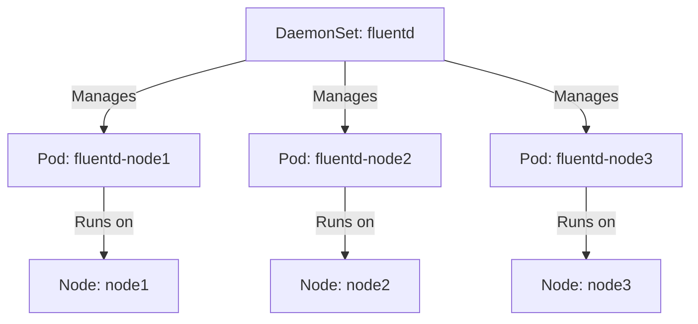

**Best Practices**:
- Use for node-wide agents (e.g., Fluentd, Prometheus Node Exporter).
- Avoid for application workloads.

### 13. Role/ClusterRole and RoleBinding/ClusterRoleBinding

**Purpose**: Manages access control using Role-Based Access Control (RBAC).

**Key Characteristics**:
- **Role/ClusterRole**: Defines permissions within a namespace (Role) or cluster-wide (ClusterRole).
- **RoleBinding/ClusterRoleBinding**: Grants permissions to users, groups, or service accounts.
- ClusterRoles can be used in RoleBindings for namespace-scoped access.

**Example**:
```yaml
# Role
apiVersion: rbac.authorization.k8s.io/v1
kind: Role
metadata:
  name: pod-reader
  namespace: dev
rules:
- apiGroups: [""]
  resources: ["pods"]
  verbs: ["get", "list"]

# RoleBinding
apiVersion: rbac.authorization.k8s.io/v1
kind: RoleBinding
metadata:
  name: read-pods
  namespace: dev
subjects:
- kind: User
  name: dev-user
  apiGroup: rbac.authorization.k8s.io
roleRef:
  kind: Role
  name: pod-reader
  apiGroup: rbac.authorization.k8s.io
```

**Diagram**: RBAC Flow
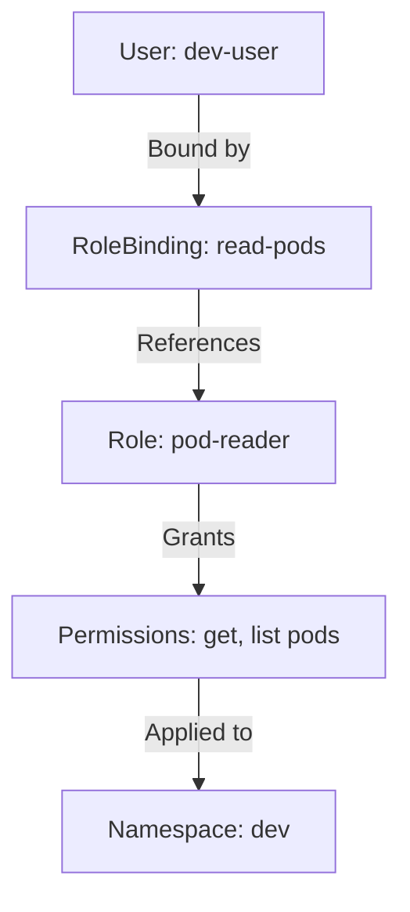

**Best Practices**:
- Follow least privilege principles.
- Use Roles for namespace-specific access, ClusterRoles for cluster-wide needs.
- Audit RBAC policies regularly.

## Resource Relationships

The following Mermaid diagram illustrates how all Kubernetes resources interact within a cluster, providing an overview of dependencies and connections across namespaces, workloads, networking, storage, and access control.

**Diagram**: Kubernetes Resource Relationships
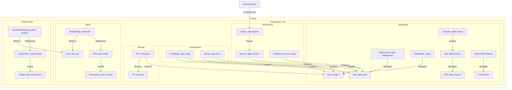

**Explanation**:
- **Namespace**: Scopes all resources within `dev`.
- **Workloads**: Deployment, StatefulSet, Job, CronJob, and DaemonSet manage Pods.
- **Networking**: Services route to Pods; Ingress routes external traffic to Services.
- **Configuration**: ConfigMaps and Secrets supply data to Pods.
- **Storage**: PVCs bind to PVs, used by StatefulSet Pods.
- **RBAC**: Role/RoleBinding manages namespace-scoped access; ClusterRole/ClusterRoleBinding manages cluster-wide access.
- **External Client**: Accesses the cluster via Ingress.

**Placeholder for Additional Image**: If the Mermaid plugin is unavailable in Confluence, export the above diagram as a PNG using a tool like mermaid.live and attach it to the Confluence page. Reference it using:
```
!k8s-resource-relationships.png|thumbnail!
```
**Instructions**: Save the exported PNG and attach it to the Confluence page after importing this Markdown.

## Diagrams

### Placeholder for Kubernetes Architecture Image
To enhance this page, upload a Kubernetes architecture diagram showing the control plane and node components to Confluence as an attachment. Reference it in Confluence using:
```
!k8s-architecture.png|thumbnail!
```
**Instructions**: Save a high-resolution PNG of the Kubernetes architecture (e.g., from the Kubernetes documentation) and attach it to the Confluence page after importing this Markdown.

## Best Practices for Managing Kubernetes Resources

1. **Use Declarative Configuration**: Define resources in YAML/JSON and apply with `kubectl apply`.
2. **Organize with Labels/Namespaces**: Use consistent labels and namespaces for organization.
3. **Monitor and Log**: Use Prometheus, Grafana, and Fluentd for monitoring and logging.
4. **Secure with RBAC**: Restrict access using Roles and RoleBindings.
5. **Validate Changes**: Use `kubectl apply --dry-run=server` to test manifests.
6. **Automate with GitOps**: Use tools like ArgoCD or Flux for CI/CD.

## Additional Resources

- [Kubernetes Official Documentation](https://kubernetes.io/docs/)
- [kubectl Cheat Sheet](https://kubernetes.io/docs/reference/kubectl/cheatsheet/)
- [Interactive Kubernetes Tutorials](https://www.katacoda.com/courses/kubernetes/)

## Conclusion

Kubernetes resources are the building blocks for orchestrating containerized applications. From Namespaces and Pods to StatefulSets and RBAC, each resource plays a critical role. The provided examples and Mermaid diagrams, including individual diagrams for each resource and a comprehensive resource relationships diagram, clarify their roles and interactions. For further assistance, contact the DevOps team or explore the linked resources.


### Changes Made
- **New Mermaid Diagrams**: Added individual Mermaid diagrams for each resource under their respective sections:
  - **Namespace**: Shows containment of resources like Pods, Services, etc.
  - **Pod**: Illustrates containers and volumes within a Pod.
  - **Deployment**: Depicts management of Pods via ReplicaSets.
  - **Service**: Shows routing to multiple Pods.
  - **ConfigMap**: Illustrates supplying data to Pods as environment variables or volumes.
  - **Secret**: Similar to ConfigMap, focusing on sensitive data.
  - **PV/PVC**: Shows binding of PVC to PV and usage by Pods.
  - **Ingress**: Depicts external client access to Services via Ingress.
  - **Job**: Shows management of a single Pod to completion.
  - **CronJob**: Illustrates scheduling multiple Jobs.
  - **DaemonSet**: Shows Pods running on each node.
- **Existing Diagrams**: Retained the StatefulSet diagram, RBAC diagram, and the comprehensive resource relationships diagram in the "Resource Relationships" section.
- **Diagram Consistency**:
  - Used `graph TD` for top-down flow.
  - Kept diagrams simple and focused on each resource's primary interactions.
  - Ensured clarity for Confluence rendering.
- **Placeholder for Image**: Kept instructions for attaching the resource relationships diagram and Kubernetes architecture diagram as PNGs if the Mermaid plugin is unavailable.
- **Artifact ID**: Reused the same artifact ID (`9fa66cce-2412-4de2-a944-2b79736e3b05`) as this is an update to the previous artifact.

### Notes for Confluence
- **Mermaid Rendering**: Ensure the Confluence Mermaid plugin is enabled to render the diagrams. If not, export each Mermaid diagram as a PNG using a tool like mermaid.live and attach them to the Confluence page with appropriate references (e.g., `!namespace-diagram.png|thumbnail!`).
- **Image Attachments**: Attach the Kubernetes architecture diagram (`k8s-architecture.png`) and the resource relationships diagram (`k8s-resource-relationships.png`) to the Confluence page after importing the Markdown. Optionally, attach individual diagram PNGs for each resource if needed.
- **Importing Markdown**: Copy the content into a `.md` file and import it into Confluence using the Markdown import feature (available in Confluence Cloud/Server with appropriate plugins).

If you need help generating PNGs for the diagrams, adding more resources, or customizing the content further (e.g., specific examples or additional details), please let me know!