I'll update the Confluence Markdown file to include a new section about **Helm Charts**, explaining their purpose, key characteristics, and best practices, along with an example Helm Chart for a simple application (e.g., a BusyBox-based chart). The section will include a Mermaid diagram to visualize the Helm Chart's structure and its interaction with Kubernetes resources. The existing content, including all resources and diagrams, will remain unchanged, and the new section will be added before the "Resource Relationships" section to maintain logical flow.

### Approach
- **New Section**: Add a "HelmChart" section under "Key Kubernetes Resources" with:
  - **Purpose**: Explain Helm Charts as a package manager for Kubernetes.
  - **Key Characteristics**: Describe templates, values, releases, and repositories.
  - **Example**: Provide a sample Helm Chart for a BusyBox application, including key files (`Chart.yaml`, `values.yaml`, and a template for a Deployment and Service).
  - **Mermaid Diagram**: Visualize the Helm Chart's structure and how it generates Kubernetes resources.
  - **Best Practices**: Offer guidance on using Helm effectively.
- **Integration**: Place the new section after the "Role/ClusterRole and RoleBinding/ClusterRoleBinding" section and before "Resource Relationships" to fit naturally in the resource list.
- **Diagrams**: Include a Mermaid diagram for the Helm Chart and a PNG placeholder for Confluence compatibility, consistent with other sections.
- **Artifact Update**: Reuse the same artifact ID (`9fa66cce-2412-4de2-a944-2b79736e3b05`) since this is an update to the previous Confluence page, with a new version ID.
- **Confluence Compatibility**: Ensure the Markdown format and Mermaid syntax are compatible with Confluence's import feature and Mermaid plugin.

### Helm Chart Example
The example will be a simple Helm Chart for deploying a BusyBox application with:
- A `Chart.yaml` defining metadata.
- A `values.yaml` for customizable parameters (e.g., replica count, image tag).
- A `templates/deployment.yaml` for a Deployment resource.
- A `templates/service.yaml` for a Service resource.

Below is the updated Markdown file with the new HelmChart section.


# Introduction to Kubernetes Resources

This page provides a comprehensive overview of Kubernetes (K8s) resources, the core components for deploying and managing containerized applications in a Kubernetes cluster. Understanding these resources is essential for leveraging Kubernetes to orchestrate workloads effectively. This guide includes detailed explanations, examples, best practices, and diagrams (with Mermaid code and PNG placeholders) to illustrate each resource's role and interactions.

## What are Kubernetes Resources?

Kubernetes resources are objects defined in YAML or JSON manifests that represent the desired state of components in a Kubernetes cluster. The Kubernetes control plane manages these objects to ensure the cluster's actual state matches the desired state. Each resource serves a specific purpose, such as managing containers, networking, storage, or access control.

## Key Kubernetes Resources

Below is a detailed explanation of essential Kubernetes resources, including their purpose, structure, examples, best practices, and diagrams.

### 1. Namespace

**Purpose**: Provides logical isolation for resources within a cluster, enabling multi-tenancy and organization.

**Key Characteristics**:
- Scopes resources like Pods, Services, and ConfigMaps to avoid naming conflicts.
- Default namespaces include `default`, `kube-system`, and `kube-public`.
- Supports RBAC for access control within a namespace.

**Example**:
```yaml
apiVersion: v1
kind: Namespace
metadata:
  name: dev
```

**Diagram**: Namespace Scope
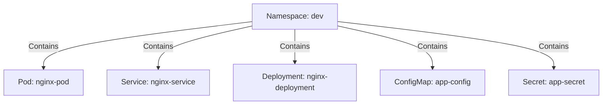
!namespace-diagram.png|thumbnail!

**Best Practices**:
- Use namespaces to separate environments (e.g., `dev`, `prod`) or teams.
- Apply resource quotas to limit CPU/memory usage per namespace.
- Avoid using the `default` namespace for production workloads.

### 2. Pod

**Purpose**: The smallest deployable unit, representing one or more containers that share storage and network.

**Key Characteristics**:
- Ephemeral and typically managed by controllers like Deployments.
- Containers in a Pod share the same network namespace (localhost communication) and storage volumes.

**Example**:
```yaml
apiVersion: v1
kind: Pod
metadata:
  name: nginx-pod
  namespace: dev
  labels:
    app: nginx
spec:
  containers:
  - name: nginx
    image: nginx:1.14.2
    ports:
    - containerPort: 80
```

**Diagram**: Pod Structure
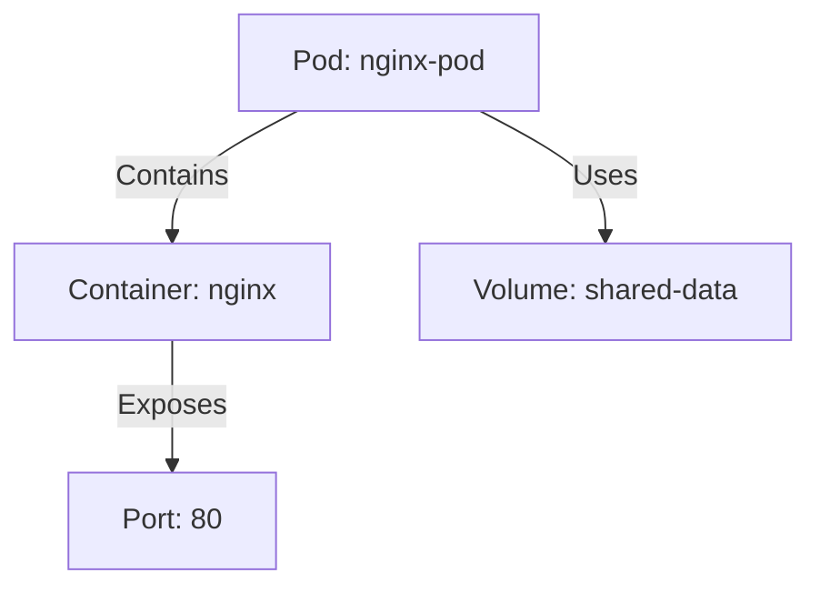
!pod-diagram.png|thumbnail!

**Best Practices**:
- Use Pods directly for debugging or one-off tasks, not production.
- Group related containers (e.g., app and logging sidecar) in a single Pod.

### 3. Deployment

**Purpose**: Manages a set of identical Pods, ensuring they are running, updated, and scaled.

**Key Characteristics**:
- Uses ReplicaSets for declarative updates.
- Supports rolling updates and rollbacks.
- Ideal for stateless applications.

**Example**:
```yaml
apiVersion: apps/v1
kind: Deployment
metadata:
  name: nginx-deployment
  namespace: dev
spec:
  replicas: 3
  selector:
    matchLabels:
      app: nginx
  template:
    metadata:
      labels:
        app: nginx
    spec:
      containers:
      - name: nginx
        image: nginx:1.14.2
        ports:
        - containerPort: 80
```

**Diagram**: Deployment Workflow
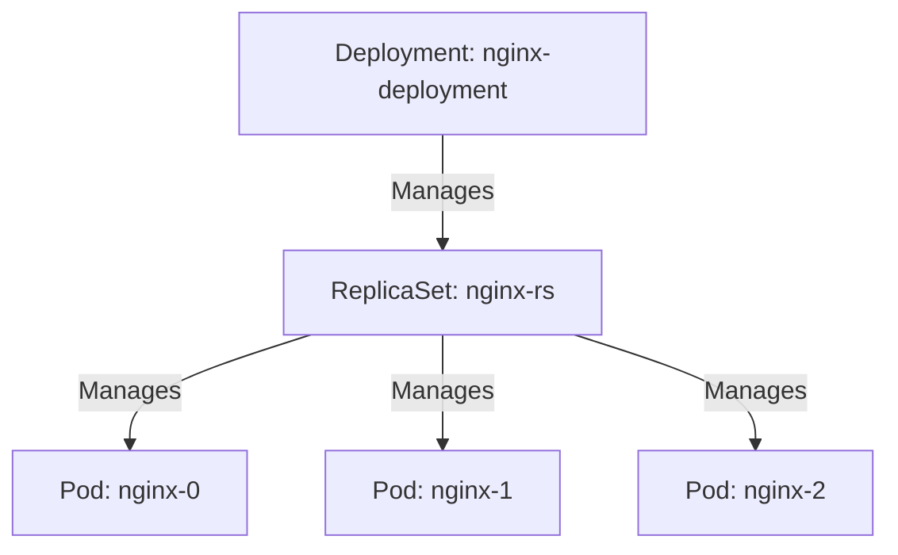
!deployment-diagram.png|thumbnail!

**Best Practices**:
- Define resource limits and requests for CPU/memory.
- Use readiness and liveness probes for Pod health checks.

### 4. Service

**Purpose**: Provides a stable network endpoint to access a set of Pods, typically via label selectors.

**Key Characteristics**:
- Abstracts Pod IP changes with load balancing.
- Types: ClusterIP (default), NodePort, LoadBalancer, ExternalName.
- Integrates with Kubernetes DNS.

**Example**:
```yaml
apiVersion: v1
kind: Service
metadata:
  name: nginx-service
  namespace: dev
spec:
  selector:
    app: nginx
  ports:
  - protocol: TCP
    port: 80
    targetPort: 80
  type: ClusterIP
```

**Diagram**: Service Routing
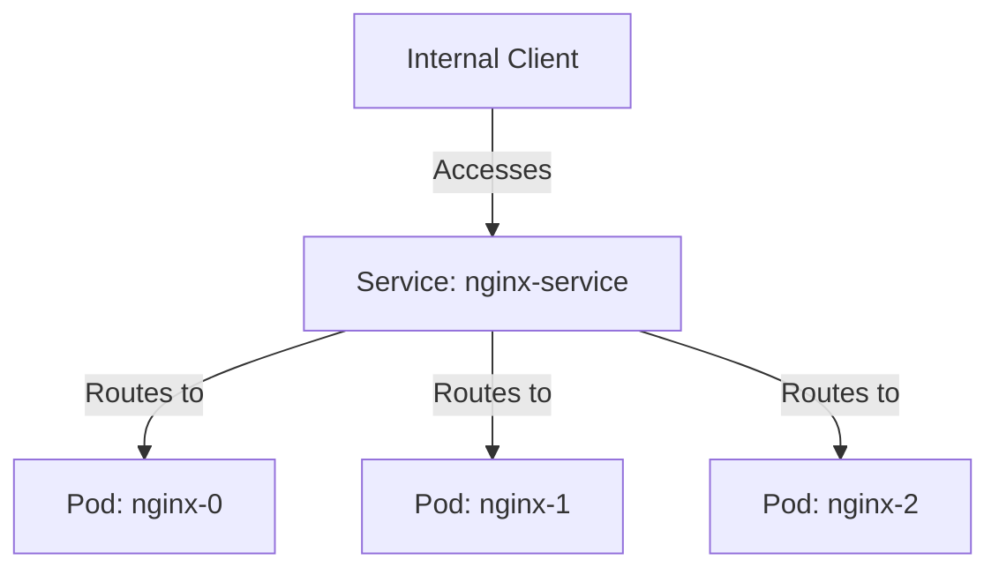
!service-diagram.png|thumbnail!

**Best Practices**:
- Use ClusterIP for internal services, LoadBalancer for external access.
- Ensure selector labels match Pod labels.

### 5. ConfigMap

**Purpose**: Stores non-sensitive configuration data as key-value pairs.

**Key Characteristics**:
- Mounted as environment variables, arguments, or volumes.
- Supports dynamic updates in some cases.

**Example**:
```yaml
apiVersion: v1
kind: ConfigMap
metadata:
  name: app-config
  namespace: dev
data:
  db_host: "mysql-service"
  log_level: "debug"
```

**Diagram**: ConfigMap Usage
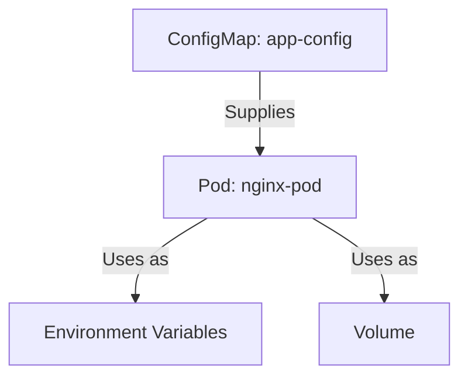
!configmap-diagram.png|thumbnail!

**Best Practices**:
- Use ConfigMaps for configuration; use Secrets for sensitive data.
- Keep ConfigMaps small to avoid performance issues.

### 6. Secret

**Purpose**: Stores sensitive data, such as passwords or tokens, in Base64-encoded format.

**Key Characteristics**:
- Mounted as environment variables or volumes.
- Access controlled via RBAC.

**Example**:
```yaml
apiVersion: v1
kind: Secret
metadata:
  name: app-secret
  namespace: dev
type: Opaque
data:
  db_password: bXlwYXNzd29yZA==  # Base64-encoded "mypassword"
```

**Diagram**: Secret Usage
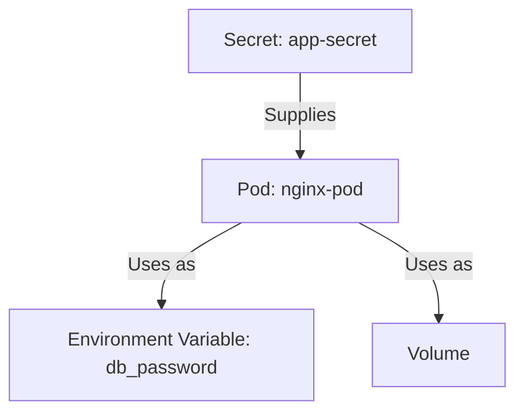
!secret-diagram.png|thumbnail!

**Best Practices**:
- Enable encryption at rest for Secrets.
- Restrict access using RBAC.

### 7. PersistentVolume (PV) and PersistentVolumeClaim (PVC)

**Purpose**: Manages storage for stateful applications.

**Key Characteristics**:
- **PV**: Represents cluster storage (static or dynamic).
- **PVC**: Requests storage, binding to a PV.
- Supports various backends (e.g., NFS, cloud storage).

**Example**:
```yaml
# PersistentVolume
apiVersion: v1
kind: PersistentVolume
metadata:
  name: mysql-pv
spec:
  capacity:
    storage: 10Gi
  accessModes:
    - ReadWriteOnce
  hostPath:
    path: "/mnt/data"

# PersistentVolumeClaim
apiVersion: v1
kind: PersistentVolumeClaim
metadata:
  name: mysql-pvc
  namespace: dev
spec:
  accessModes:
    - ReadWriteOnce
  resources:
    requests:
      storage: 10Gi
```

**Diagram**: PV and PVC Interaction
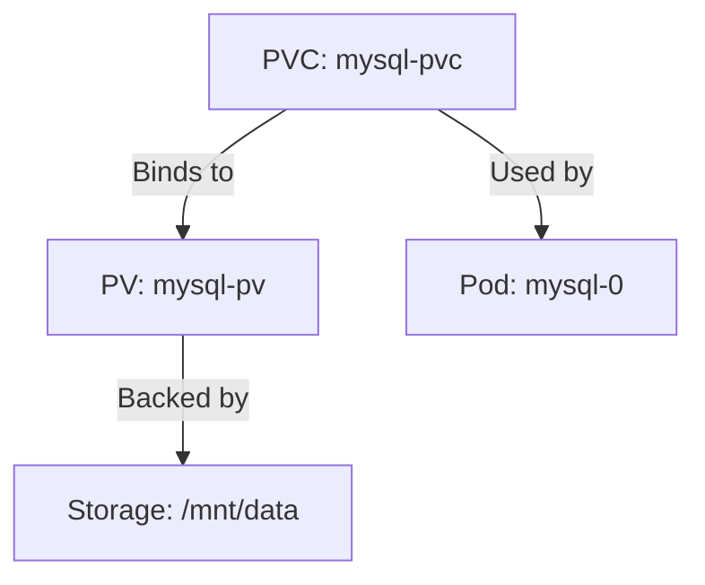
!pv-pvc-diagram.png|thumbnail!

**Best Practices**:
- Use dynamic provisioning with StorageClasses.
- Backup critical data in PVs.

### 8. StatefulSet

**Purpose**: Manages stateful applications with stable identities and persistent storage.

**Key Characteristics**:
- Provides unique Pod names (e.g., `mysql-0`, `mysql-1`).
- Ensures ordered deployment/scaling.
- Pairs with PVCs and headless Services.

**Example**:
```yaml
apiVersion: apps/v1
kind: StatefulSet
metadata:
  name: mysql
  namespace: dev
spec:
  serviceName: "mysql"
  replicas: 3
  selector:
    matchLabels:
      app: mysql
  template:
    metadata:
      labels:
        app: mysql
    spec:
      containers:
      - name: mysql
        image: mysql:5.7
        env:
        - name: MYSQL_ROOT_PASSWORD
          valueFrom:
            secretKeyRef:
              name: app-secret
              key: db_password
        volumeMounts:
        - name: mysql-persistent-storage
          mountPath: "/var/lib/mysql"
  volumeClaimTemplates:
  - metadata:
      name: mysql-persistent-storage
    spec:
      accessModes: ["ReadWriteOnce"]
      resources:
        requests:
          storage: 10Gi
```

**Diagram**: StatefulSet Architecture
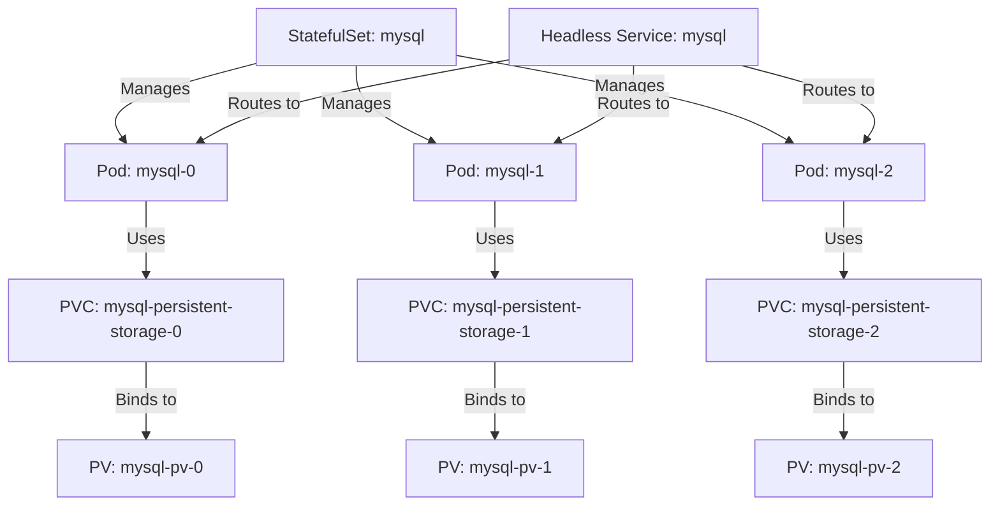
!statefulset-diagram.png|thumbnail!

**Best Practices**:
- Use for databases or stateful apps.
- Pair with headless Services for stable DNS.

### 9. Ingress

**Purpose**: Manages external HTTP/HTTPS access to Services with URL-based routing.

**Key Characteristics**:
- Requires an Ingress Controller (e.g., NGINX).
- Supports path-based routing and SSL.

**Example**:
```yaml
apiVersion: networking.k8s.io/v1
kind: Ingress
metadata:
  name: app-ingress
  namespace: dev
  annotations:
    nginx.ingress.kubernetes.io/rewrite-target: /
spec:
  rules:
  - host: example.com
    http:
      paths:
      - path: /app
        pathType: Prefix
        backend:
          service:
            name: nginx-service
            port:
              number: 80
```

**Diagram**: Ingress Routing
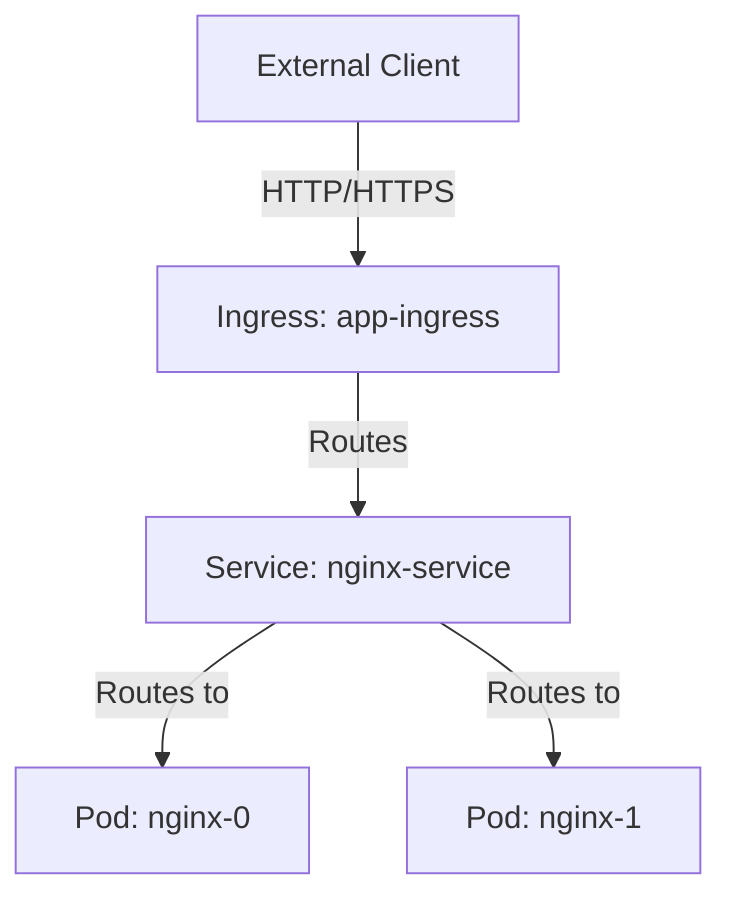
!ingress-diagram.png|thumbnail!

**Best Practices**:
- Secure with TLS certificates.
- Monitor Ingress Controller performance.

### 10. Job

**Purpose**: Manages one-off tasks that run to completion.

**Key Characteristics**:
- Ensures Pods complete their task successfully.
- Supports parallelism for batch processing.

**Example**:
```yaml
apiVersion: batch/v1
kind: Job
metadata:
  name: data-process
  namespace: dev
spec:
  template:
    spec:
      containers:
      - name: processor
        image: data-processor:1.0
      restartPolicy: Never
  backoffLimit: 4
```

**Diagram**: Job Execution
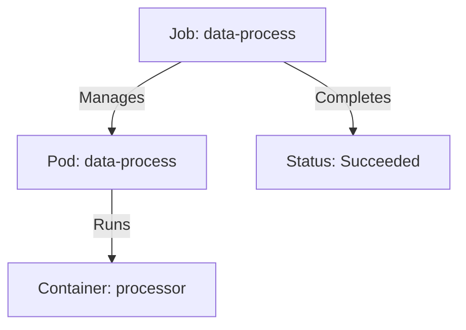
!job-diagram.png|thumbnail!

**Best Practices**:
- Use Jobs for tasks like database migrations or batch jobs.
- Set `backoffLimit` and `restartPolicy` appropriately.

### 11. CronJob

**Purpose**: Schedules recurring tasks using a cron-like schedule.

**Key Characteristics**:
- Creates Jobs at specified intervals.
- Supports concurrency policies (e.g., `Forbid`, `Allow`).

**Example**:
```yaml
apiVersion: batch/v1
kind: CronJob
metadata:
  name: nightly-report
  namespace: dev
spec:
  schedule: "0 1 * * *"
  jobTemplate:
    spec:
      template:
        spec:
          containers:
          - name: report-gen
            image: report-generator:1.0
          restartPolicy: OnFailure
```

**Diagram**: CronJob Scheduling
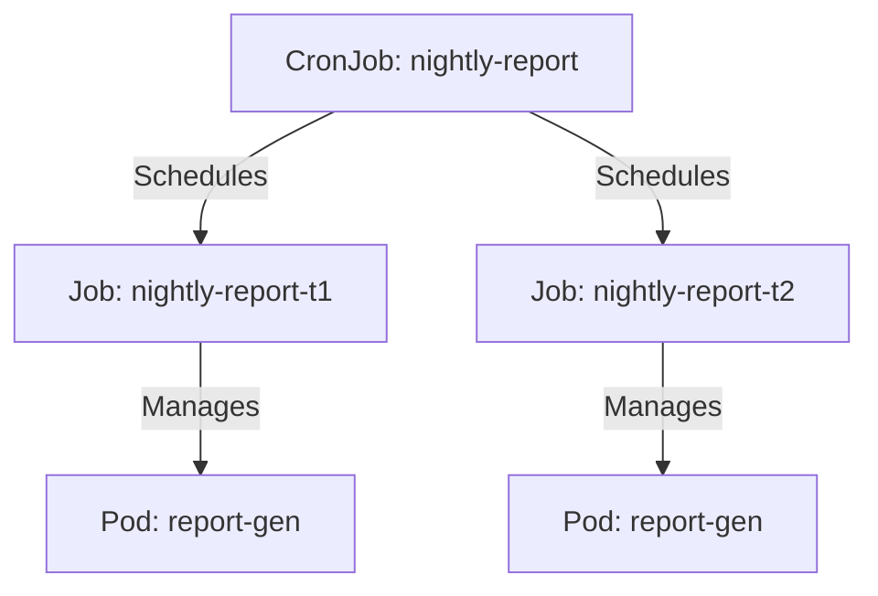
!cronjob-diagram.png|thumbnail!

**Best Practices**:
- Use for scheduled tasks like backups or reports.
- Monitor job history to avoid resource accumulation.

### 12. DaemonSet

**Purpose**: Ensures a Pod runs on every node in the cluster (or a subset).

**Key Characteristics**:
- Ideal for node-level tasks like logging or monitoring agents.
- Automatically scales with cluster nodes.

**Example**:
```yaml
apiVersion: apps/v1
kind: DaemonSet
metadata:
  name: fluentd
  namespace: dev
spec:
  selector:
    matchLabels:
      app: fluentd
  template:
    metadata:
      labels:
        app: fluentd
    spec:
      containers:
      - name: fluentd
        image: fluentd:1.14
```

**Diagram**: DaemonSet Distribution
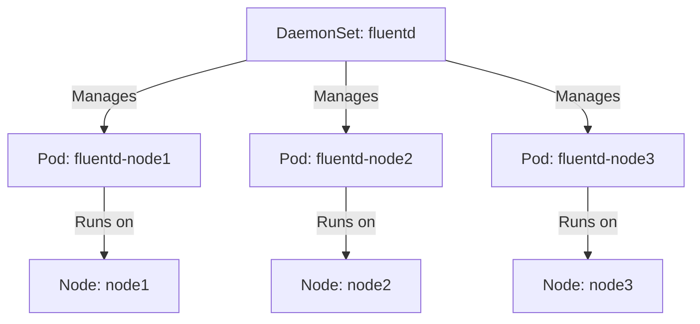
!daemonset-diagram.png|thumbnail!

**Best Practices**:
- Use for node-wide agents (e.g., Fluentd, Prometheus Node Exporter).
- Avoid for application workloads.

### 13. Role/ClusterRole and RoleBinding/ClusterRoleBinding

**Purpose**: Manages access control using Role-Based Access Control (RBAC).

**Key Characteristics**:
- **Role/ClusterRole**: Defines permissions within a namespace (Role) or cluster-wide (ClusterRole).
- **RoleBinding/ClusterRoleBinding**: Grants permissions to users, groups, or service accounts.
- ClusterRoles can be used in RoleBindings for namespace-scoped access.

**Example**:
```yaml
# Role
apiVersion: rbac.authorization.k8s.io/v1
kind: Role
metadata:
  name: pod-reader
  namespace: dev
rules:
- apiGroups: [""]
  resources: ["pods"]
  verbs: ["get", "list"]

# RoleBinding
apiVersion: rbac.authorization.k8s.io/v1
kind: RoleBinding
metadata:
  name: read-pods
  namespace: dev
subjects:
- kind: User
  name: dev-user
  apiGroup: rbac.authorization.k8s.io
roleRef:
  kind: Role
  name: pod-reader
  apiGroup: rbac.authorization.k8s.io
```

**Diagram**: RBAC Flow
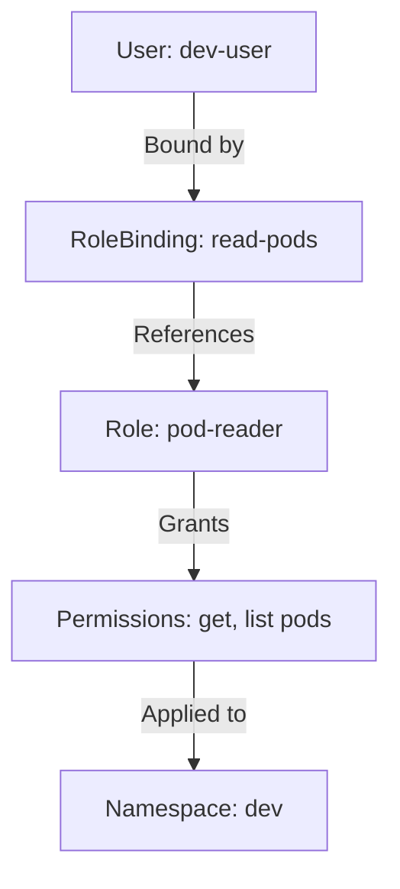
!rbac-diagram.png|thumbnail!

**Best Practices**:
- Follow least privilege principles.
- Use Roles for namespace-specific access, ClusterRoles for cluster-wide needs.
- Audit RBAC policies regularly.

### 14. HelmChart

**Purpose**: Packages and manages Kubernetes resources as reusable templates, simplifying deployment and configuration.

**Key Characteristics**:
- Helm Charts are collections of YAML templates and configuration files that define Kubernetes resources.
- Key components include `Chart.yaml` (metadata), `values.yaml` (default configurations), and `templates/` (resource manifests).
- Supports versioning, dependency management, and release tracking.
- Helm, the package manager, deploys charts as releases, allowing upgrades and rollbacks.

**Example**: Below is a sample Helm Chart for a BusyBox application, including a Deployment and Service.

```yaml
# Chart.yaml
apiVersion: v2
name: busybox
description: A Helm chart for deploying a BusyBox application
version: 0.1.0
appVersion: "1.35"

# values.yaml
replicaCount: 2
image:
  repository: busybox
  tag: "1.35"
  pullPolicy: IfNotPresent
service:
  type: ClusterIP
  port: 80

# templates/deployment.yaml
apiVersion: apps/v1
kind: Deployment
metadata:
  name: {{ .Release.Name }}-busybox
  namespace: {{ .Release.Namespace }}
spec:
  replicas: {{ .Values.replicaCount }}
  selector:
    matchLabels:
      app: {{ .Release.Name }}-busybox
  template:
    metadata:
      labels:
        app: {{ .Release.Name }}-busybox
    spec:
      containers:
      - name: busybox
        image: {{ .Values.image.repository }}:{{ .Values.image.tag }}
        imagePullPolicy: {{ .Values.image.pullPolicy }}
        command: ["sh", "-c", "sleep 3600"]

# templates/service.yaml
apiVersion: v1
kind: Service
metadata:
  name: {{ .Release.Name }}-busybox
  namespace: {{ .Release.Namespace }}
spec:
  selector:
    app: {{ .Release.Name }}-busybox
  ports:
  - protocol: TCP
    port: {{ .Values.service.port }}
    targetPort: 80
  type: {{ .Values.service.type }}
```

**Diagram**: Helm Chart Structure
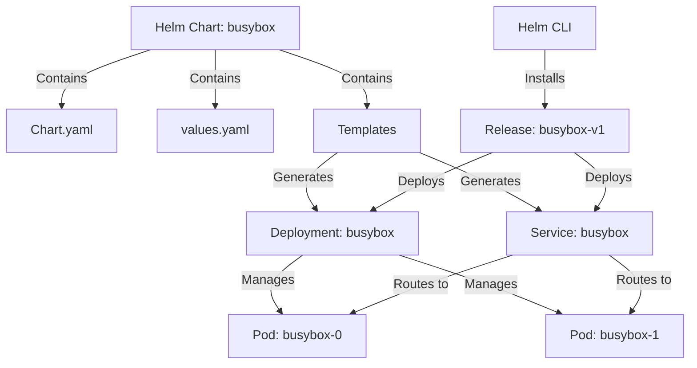
!helmchart-diagram.png|thumbnail!

**Instructions**: Generate the PNG for the above diagram using a tool like mermaid.live and attach it as `helmchart-diagram.png` to the Confluence page.

**Best Practices**:
- Use Helm Charts for reusable, parameterized deployments.
- Store charts in a Helm repository (e.g., ChartMuseum, Harbor) for version control.
- Keep `values.yaml` defaults sensible and document overrides.
- Use Helm's `--dry-run` flag to validate chart rendering before deployment.
- Include dependencies in `Chart.yaml` for complex applications.
- Regularly update charts to align with application and Kubernetes versions.

## Resource Relationships

The following Mermaid diagram illustrates how all Kubernetes resources, including Helm Charts, interact within a cluster, providing an overview of dependencies and connections across namespaces, workloads, networking, storage, and access control.

**Diagram**: Kubernetes Resource Relationships
```mermaid
graph TD
    subgraph Cluster
        subgraph Namespace[Namespace: dev]
            subgraph Workloads
                POD[Pod: nginx-pod]
                DEP[Deployment: nginx-deployment] -->|Manages| POD
                STS[StatefulSet: mysql] -->|Manages| POD_STS[Pod: mysql-0]
                JOB[Job: data-process] -->|Manages| POD_JOB[Pod: data-process]
                CRON[CronJob: nightly-report] -->|Creates| JOB
                DS[DaemonSet: fluentd] -->|Manages| POD_DS[Pod: fluentd]
                HELM[Helm Release: busybox] -->|Deploys| DEP_HELM[Deployment: busybox]
                HELM -->|Deploys| SVC_HELM[Service: busybox]
                DEP_HELM -->|Manages| POD_HELM[Pod: busybox-0]
            end
            subgraph Networking
                SVC[Service: nginx-service] -->|Routes to| POD
                SVC_STS[Headless Service: mysql] -->|Routes to| POD_STS
                ING[Ingress: app-ingress] -->|Routes| SVC
                SVC_HELM -->|Routes to| POD_HELM
            end
            subgraph Configuration
                CM[ConfigMap: app-config] -->|Supplies| POD
                CM -->|Supplies| POD_STS
                SEC[Secret: app-secret] -->|Supplies| POD
                SEC -->|Supplies| POD_STS
            end
            subgraph Storage
                PVC[PVC: mysql-pvc] -->|Used by| POD_STS
                PVC -->|Binds to| PV[PV: mysql-pv]
            end
            subgraph RBAC
                ROLE[Role: pod-reader] -->|Grants| PERM[Permissions: get, list pods]
                RB[RoleBinding: read-pods] -->|References| ROLE
                RB -->|Binds to| USER[User: dev-user]
            end
        end
        subgraph Cluster-Wide
            CR[ClusterRole: cluster-admin] -->|Grants| CPERM[Cluster-wide permissions]
            CRB[ClusterRoleBinding: admin-binding] -->|References| CR
            CRB -->|Binds to| USER
            PV
        end
    end
    CLIENT[External Client] -->|HTTP/HTTPS| ING
```
!resource-relationships-diagram.png|thumbnail!

**Explanation**:
- **Namespace**: Scopes all resources within `dev`.
- **Workloads**: Deployment, StatefulSet, Job, CronJob, DaemonSet, and Helm Releases manage Pods.
- **Networking**: Services route to Pods; Ingress routes external traffic to Services.
- **Configuration**: ConfigMaps and Secrets supply data to Pods.
- **Storage**: PVCs bind to PVs, used by StatefulSet Pods.
- **RBAC**: Role/RoleBinding manages namespace-scoped access; ClusterRole/ClusterRoleBinding manages cluster-wide access.
- **HelmChart**: Deploys resources like Deployments and Services via releases.
- **External Client**: Accesses the cluster via Ingress.

**Instructions**: Generate the PNG for the above diagram using a tool like mermaid.live and attach it as `resource-relationships-diagram.png` to the Confluence page.

## Diagrams

### Placeholder for Kubernetes Architecture Image
To enhance this page, upload a Kubernetes architecture diagram showing the control plane and node components to Confluence as an attachment. Reference it in Confluence using:
```
!k8s-architecture.png|thumbnail!
```
**Instructions**: Save a high-resolution PNG of the Kubernetes architecture (e.g., from the Kubernetes documentation) and attach it to the Confluence page after importing this Markdown.

## Best Practices for Managing Kubernetes Resources

1. **Use Declarative Configuration**: Define resources in YAML/JSON and apply with `kubectl apply` or Helm.
2. **Organize with Labels/Namespaces**: Use consistent labels and namespaces for organization.
3. **Monitor and Log**: Use Prometheus, Grafana, and Fluentd for monitoring and logging.
4. **Secure with RBAC**: Restrict access using Roles and RoleBindings.
5. **Validate Changes**: Use `kubectl apply --dry-run=server` or `helm install --dry-run` to test manifests.
6. **Automate with GitOps**: Use tools like ArgoCD or Flux for CI/CD, integrating Helm Charts.

## Additional Resources

- [Kubernetes Official Documentation](https://kubernetes.io/docs/)
- [Helm Official Documentation](https://helm.sh/docs/)
- [kubectl Cheat Sheet](https://kubernetes.io/docs/reference/kubectl/cheatsheet/)
- [Interactive Kubernetes Tutorials](https://www.katacoda.com/courses/kubernetes/)

## Conclusion

Kubernetes resources, including Helm Charts, are the building blocks for orchestrating containerized applications. From Namespaces and Pods to Helm Releases and RBAC, each resource plays a critical role. The provided examples and diagrams, including individual Mermaid diagrams with PNG placeholders for each resource and a comprehensive resource relationships diagram, clarify their roles and interactions. For further assistance, contact the DevOps team or explore the linked resources.


### Changes Made
- **New HelmChart Section**: Added a section under "Key Kubernetes Resources" for Helm Charts, including:
  - Purpose and characteristics.
  - A sample BusyBox Helm Chart with `Chart.yaml`, `values.yaml`, and templates for a Deployment and Service.
  - A Mermaid diagram showing the chart's structure and deployment process.
  - Best practices for Helm usage.
  - A PNG placeholder (`helmchart-diagram.png`) for Confluence compatibility.
- **Updated Resource Relationships Diagram**: Modified the comprehensive Mermaid diagram to include Helm Releases, showing how they deploy resources like Deployments and Services.
- **Placement**: Positioned the HelmChart section after RBAC and before Resource Relationships to maintain logical flow.
- **Artifact ID**: Reused the same artifact ID (`9fa66cce-2412-4de2-a944-2b79736e3b05`) as this is an update to the previous artifact, with a new version ID.
- **Consistency**: Ensured the new section follows the same structure as others, with a YAML example, Mermaid diagram, PNG placeholder, and best practices.

### How to Use the Helm Chart Example
1. **Create the Chart**:
   - Create a directory structure for the Helm Chart:
     ```
     busybox/
     ├── Chart.yaml
     ├── values.yaml
     └── templates/
         ├── deployment.yaml
         └── service.yaml
     ```
   - Copy the YAML content from the example into the respective files.
2. **Install the Chart**:
   - Ensure Helm is installed and the `dev` namespace exists:
     ```bash
     kubectl create namespace dev
     ```
   - Install the chart:
     ```bash
     helm install busybox ./busybox --namespace dev
     ```
   - Override values if needed (e.g., `helm install busybox ./busybox --set replicaCount=3`).
3. **Verify Deployment**:
   - Check the deployed resources:
     ```bash
     kubectl -n dev get deployment,service,pod
     ```
4. **Generate PNG for Diagram**:
   - Copy the Helm Chart Mermaid diagram code to [mermaid.live](https://mermaid.live/).
   - Download as `helmchart-diagram.png` and attach to the Confluence page.

### Notes for Confluence
- **Mermaid Rendering**: Ensure the Confluence Mermaid plugin is enabled to render the diagrams. If not, generate PNGs for all diagrams (including the new `helmchart-diagram.png`) using mermaid.live and attach them to the Confluence page.
- **Image Attachments**: Attach all PNGs (`namespace-diagram.png`, `pod-diagram.png`, ..., `helmchart-diagram.png`, `resource-relationships-diagram.png`, `k8s-architecture.png`) to the Confluence page after importing the Markdown.
- **Importing Markdown**: Copy the content into a `.md` file and import it into Confluence using the Markdown import feature.
- **Helm Chart Files**: The example shows key files, but a full chart may include additional files (e.g., `templates/NOTES.txt`, `charts/` for dependencies). For simplicity, only essential files are included.

If you need help generating the PNGs, adding more Helm Chart examples (e.g., with ConfigMap or Secret), integrating the BusyBox Pod YAML from the previous response, or further customizing the Confluence page, please let me know!